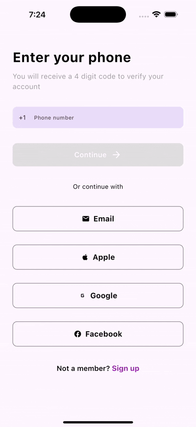

# Sign In Form

A modern, responsive sign-in form built with Flutter featuring phone number validation, social login options, and a beautiful UI.

## Demo



_Note: To add the demo, record a screen capture of the app showing:_

1. _Phone number input with validation_
2. _Loading state_
3. _Success dialog_
4. _Social login options_

## Features

- 📱 Phone number input with country code selection
- ✅ Real-time validation
- 🔄 Loading state with overlay
- ✨ Success dialog with animation
- 🎨 Modern UI with custom buttons
- 🔗 Social login options (Email, Apple, Google, Facebook)
- 📱 Responsive design
- ✅ Form validation
- 🧪 Unit tests

## Getting Started

### Prerequisites

- Flutter SDK (^3.6.1)
- Dart SDK
- Android Studio / VS Code

### Installation

1. Clone the repository

```bash
git clone https://github.com/yourusername/sign_in_form.git
```

2. Install dependencies

```bash
flutter pub get
```

3. Run the app

```bash
flutter run
```

## Project Structure

```
lib/
  ├── constants/
  │   └── styles.dart
  ├── screens/
  │   └── sign_in_page.dart
  ├── utils/
  │   └── dialog_utils.dart
  ├── widgets/
  │   ├── button.dart
  │   ├── loading_overlay.dart
  │   ├── phone_number_input_field.dart
  │   └── success_dialog.dart
  └── main.dart
```

## Testing

The project includes widget tests covering the main functionality. To run the tests:

```bash
flutter test
```

### Test Coverage

- UI elements rendering
- Button state management
- Form validation
- Social login buttons
- Navigation elements

## Dependencies

- flutter_screenutil: ^5.9.3
- intl_phone_field: ^3.2.0
- cupertino_icons: ^1.0.8

## Contributing

1. Fork the repository
2. Create your feature branch (`git checkout -b feature/AmazingFeature`)
3. Commit your changes (`git commit -m 'Add some AmazingFeature'`)
4. Push to the branch (`git push origin feature/AmazingFeature`)
5. Open a Pull Request

## Adding Your Demo

To add your demo to this README:

1. Record a screen capture of your app (preferably in GIF format)
2. Create a `demo` folder in your project root
3. Add the recording as `app_demo.gif`
4. The demo will automatically appear in this README

## License

This project is licensed under the MIT License - see the LICENSE file for details
